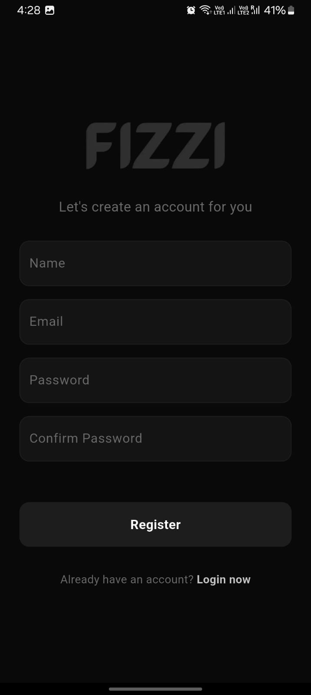
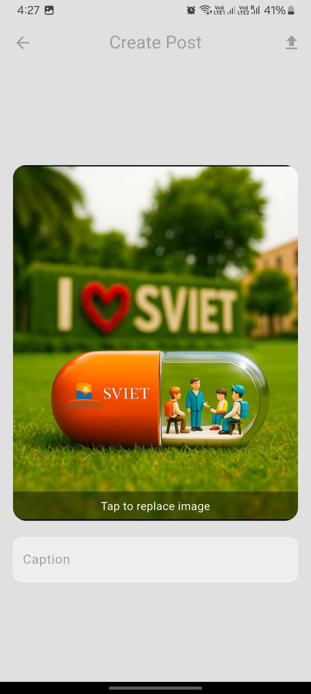
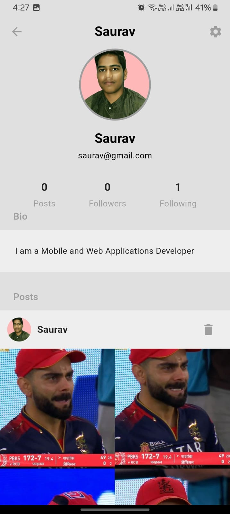
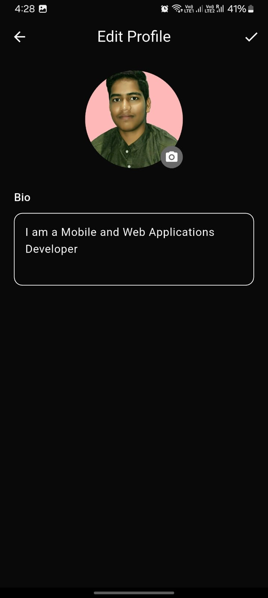
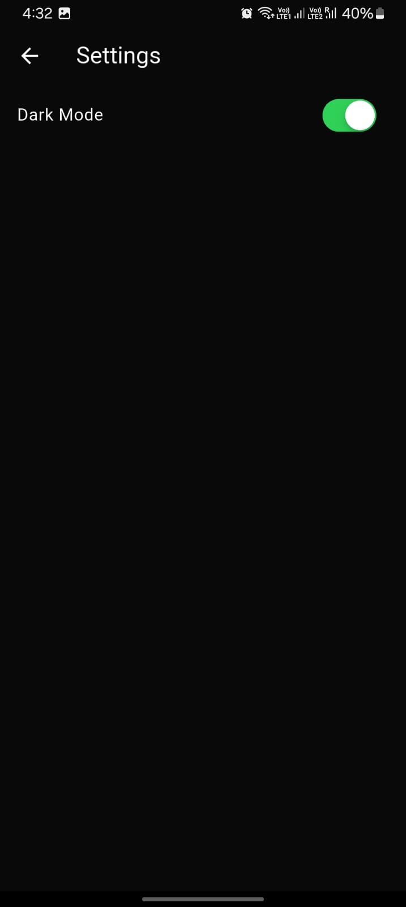

# Fizzi

Fizzi is a modern Flutter-based social media app designed for seamless interaction, content sharing, and community engagement. It leverages Firebase for authentication and Firestore for real-time data, with Cloudinary for media uploads.

## Features

* **Authentication & Profile:** Email/password login, profile creation, and editing with avatar and bio.
* **Social Feed:** Follow/unfollow users, view personalized feed with posts in real-time.
* **Post Management:** Create, edit, delete posts with text and images, like, and comment.
* **Media Handling:** Upload and display images with Cloudinary integration and caching.
* **Dark Mode:** use the app in dark mode as well.
* **Search & Explore:** Find users quickly.
* **Responsive UI:** Smooth, user-friendly interface with Flutter widgets.
* **State Management:** Organized app architecture with BLoC (cubits) for maintainability.

## Tech Stack

* Flutter & Dart
* Firebase (Auth, Firestore)
* Cloudinary (image uploads)
* flutter\_bloc for state management
* cached\_network\_image for image caching

## Demo

Check out the live demo here: [Fizzi Demo](https://fizzi-de98e.web.app/)

## Screenshots

| Register                                                              | Login                                                              | Home                                                              |
| --------------------------------------------------------------------- | ------------------------------------------------------------------ | ----------------------------------------------------------------- |
|  |  |  |

| Create Post                                                             | Profile                                                              | Edit Profile                                                             |
| ----------------------------------------------------------------------- | -------------------------------------------------------------------- | ------------------------------------------------------------------------ |
|  |  |  |

| Dark Mode                                                             | Connections                                                              |   |
| --------------------------------------------------------------------- | ------------------------------------------------------------------------ | - |
|  |  |   |


## Environment Configuration (.env)

Create a `.env` file in the project root with the following variables:

```env
# Cloudinary configuration
CLOUDINARY_DB_NAME=your_cloud_name
CLOUDINARY_DB_UPLOADPRESET=your_upload_preset

```
## Setup

1. Clone the repo:

```bash
git clone https://github.com/Saurav-KumarSingh/Fizzi.git
cd fizzi
```

2. Install dependencies:

```bash
flutter pub get
```

3. Configure Firebase and Cloudinary credentials in `.env`
4. Run the app:

```bash
flutter run
```
